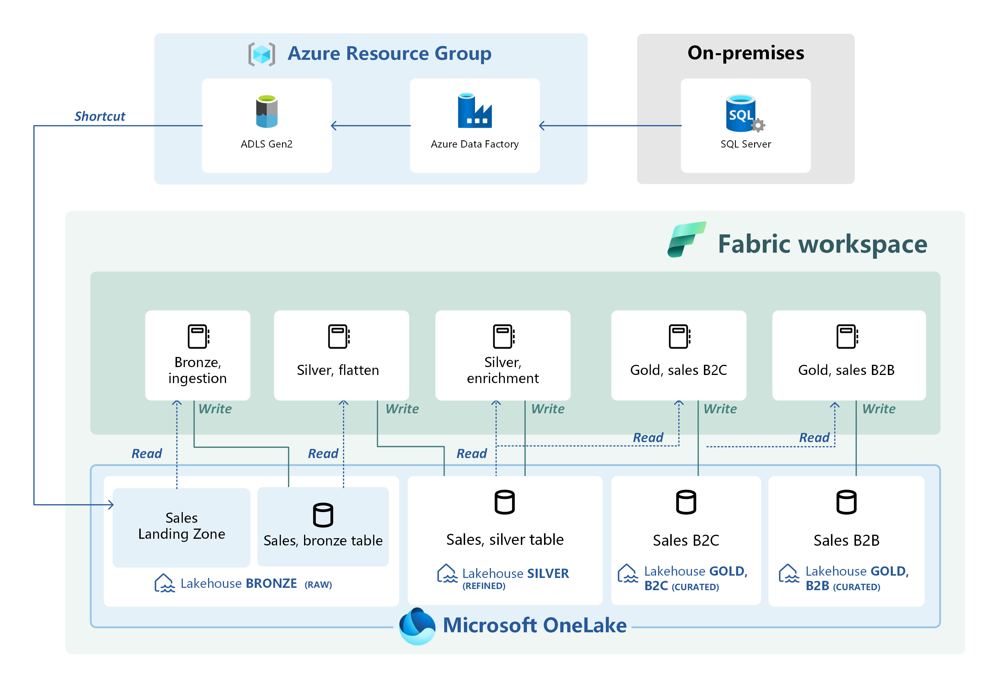

# Adventure Works: Sales Data Mart

## Overview

This project utilizes the AdventureWorks2022 Full database to simulate the implementation of Microsoft Fabric workspaces for different departments within the company. The focus is currently on the **Sales Workspace**, which includes the following components:

- **Bronze Lakehouse**: Raw data ingestion
- **Silver Lakehouse**: Data cleansing and transformation
- **Gold Lakehouses**: Final data storage for B2C and B2B sales

The data pipeline extracts data from Azure Data Lake Storage Gen2, processes it using the Medallion Architecture, and stores the clean/final data in dedicated lakehouses for B2C and B2B sales.

## Implementation Details

### Data Source
- **Source**: AdventureWorksSales view from an on-premises SQL Server database.

### Ingestion Process
1. **Azure Data Factory (ADF)**:
   - Updated data is ingested using ADF.
   - Data is stored in the `sales` container of ADLS Gen2 in Parquet format with append operations.
   
2. **Microsoft Fabric Ingestion**:
   - Data is accessed in the `Sales_LH_Bronze` through shortcuts in files.
   - Using the `Sales Bronze Ingestion` notebook, data is ingested and stored in managed Delta Tables within the same lakehouse.

### Silver Layer Processing
1. **Flatten**:
   - Data is accessed in `Sales_LH_Bronze` using the `Sales_Silver_Flatten` notebook.
   - Nested XML data in the columns `AdditionalContactInfo` and `Demographics` is flattened.
   
2. **Enrichment**:
   - Additional information is added to the data.
   - Data is separated into B2C and B2B sales.
   - Data is stored in Delta Lake in `Sales_LH_Gold_B2C` and `Sales_LH_Gold_B2B` respectively.

### Gold Layer and Data Modeling
- Using data in the Gold lakehouses, a star schema data model is constructed for analysis.

### Assumptions 
- It is assumed that the data schema will not change over time. Therefore, the lakehouse schemas are built based on this condition.

## Additional Features
- **Deployment Pipelines**: Utilize Microsoft Fabric deployment pipelines to integrate CI/CD into the project.
- **Version Control**: Leverage Azure DevOps repositories for version control.

## Future Enhancements
- Transform Gold lakehouses to warehouses for query performance.
